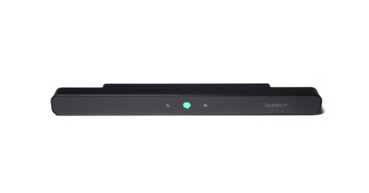
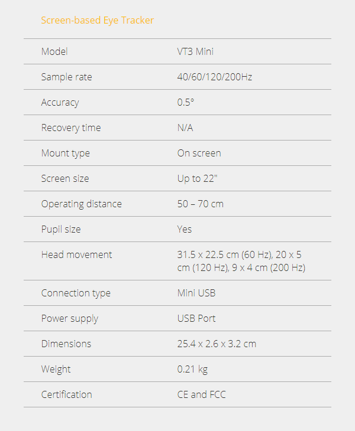
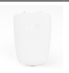
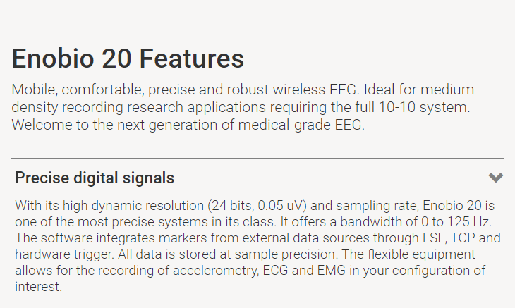
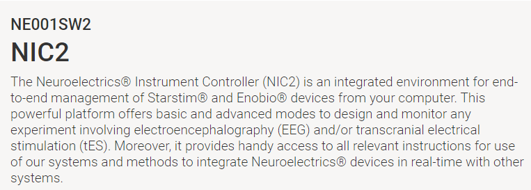

 

The Applied Psychology department recently acquired new software and hardware for use in research and academic settings. 

This site aims to provide an overview of the equipment and software as well as proper use and care. 
  

## Hardware: EyeTech VT3 Mini
  - [Eyetech VT3 Mini](https://imotions.com/hardware/eyetech-vt3-mini/)
   
  
 
  
  

## Software: EyeTech VT3 Mini

[iMotions](https://imotions.com/platform/)
  
iMotions acts as a bridge between the peripherals (Eyetracker and EEG). It aims to consolidate everything into one window. While the use case for collecting eyetracking data and EEG data simultaneously is quite limited, it is important to know that this is the application that will house the ability to do such analyses. 

  ***
## Hardware: Neuroelectrics Enobio 20
  
  - [Enobio 20 System](https://www.neuroelectrics.com/solutions/enobio/20/)
   
    
  
  
  
## Software Neuroelectrics Enobio 20
  - 
  
  